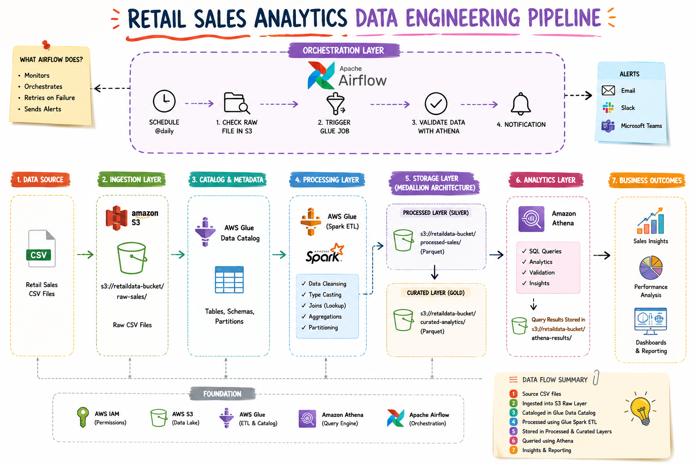
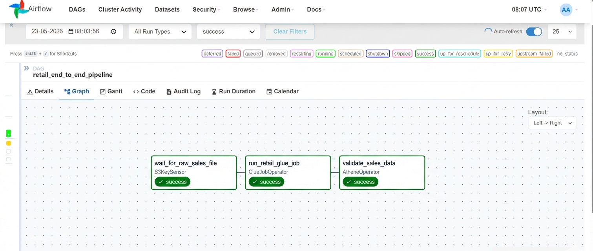
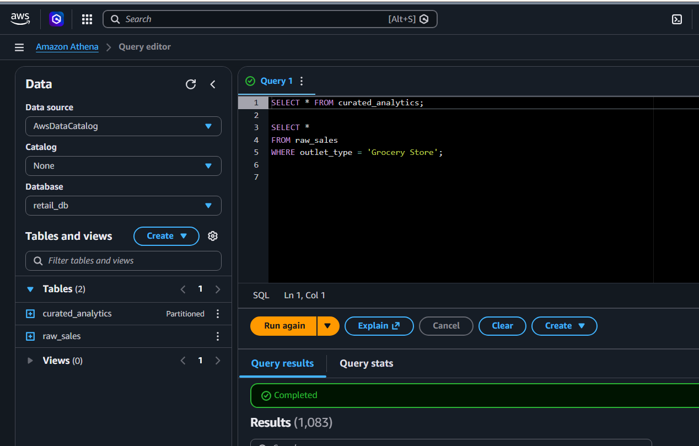
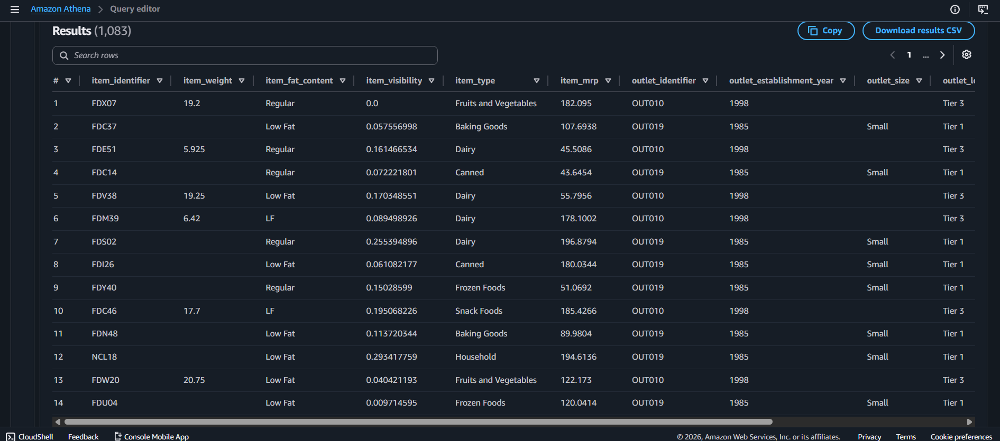
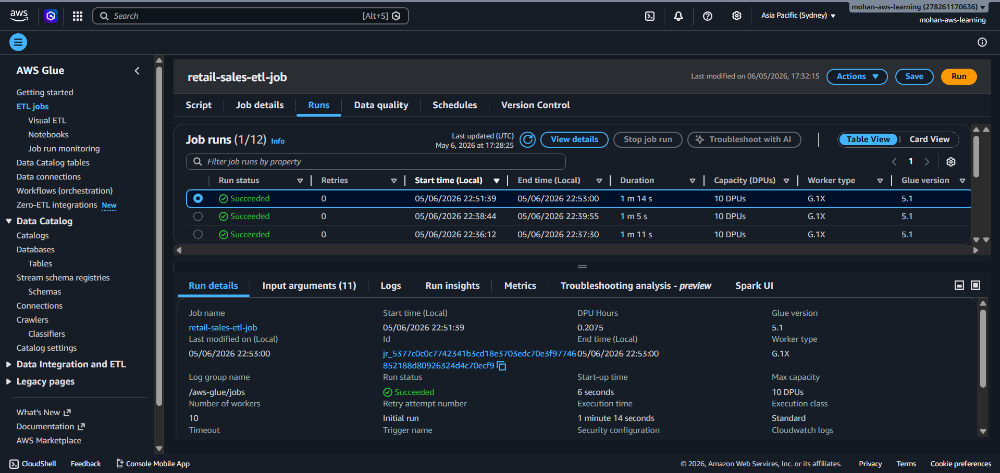
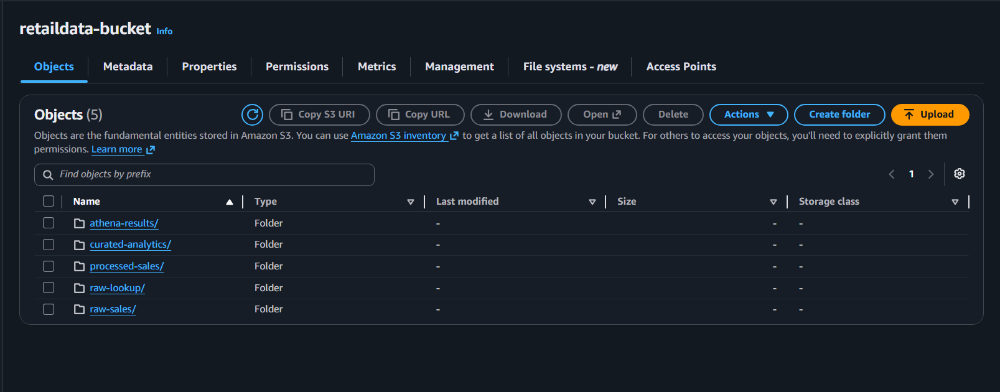

# Retail Sales Analytics Data Engineering Pipeline

## Project Overview

This project demonstrates an end-to-end cloud-native data engineering pipeline built using AWS services and Apache Airflow.

The pipeline ingests raw retail sales CSV data into Amazon S3, processes and transforms the data using AWS Glue (PySpark), stores optimized parquet datasets in a layered data lake architecture, validates analytics using Amazon Athena, and orchestrates the complete workflow using Apache Airflow.

---

# Architecture


---

# Tech Stack

| Service / Tool | Purpose |
|---|---|
| Amazon S3 | Data lake storage |
| AWS Glue | Spark ETL processing |
| AWS Glue Catalog | Metadata management |
| Apache Spark | Distributed data processing |
| Amazon Athena | SQL analytics on S3 |
| Apache Airflow | Workflow orchestration |
| Python | ETL & orchestration scripting |
| Parquet | Optimized analytics storage format |

---

# Project Architecture Flow

```text
Raw CSV Files
      ↓
Amazon S3 Raw Layer
      ↓
Glue Data Catalog
      ↓
AWS Glue Spark ETL
      ↓
Processed Parquet Layer (Silver)
      ↓
Curated Analytics Layer (Gold)
      ↓
Amazon Athena Queries
      ↓
Apache Airflow Orchestration
```

---

# Data Lake Layers

## Bronze Layer (Raw)

Stores original CSV retail sales files.

```text
s3://retaildata-bucket/raw-sales/
```

---

## Silver Layer (Processed)

Stores cleaned and transformed parquet datasets partitioned by outlet type.

```text
s3://retaildata-bucket/processed-sales/
```

---

## Gold Layer (Curated Analytics)

Stores business-ready aggregated analytics datasets.

```text
s3://retaildata-bucket/curated-analytics/
```

---

# ETL Transformations Performed

The Glue Spark ETL job performs:

- Data cleansing
- Null filtering
- Invalid sales removal
- CSV to parquet conversion
- Partitioning by outlet type
- Aggregation for analytics

Example transformation:

```python
df_clean = df.filter(
    col("item_outlet_sales").isNotNull() &
    (col("item_outlet_sales") > 0)
)
```

---

# Airflow Orchestration

Apache Airflow orchestrates the complete workflow.

Pipeline tasks:

1. Detect raw sales file in S3
2. Trigger AWS Glue ETL job
3. Validate curated analytics using Athena
4. Store Athena query results in S3

Features implemented:

- Task dependencies
- Retry handling
- Daily scheduling
- AWS integration
- Automated workflow execution

---

# Athena Analytics

Amazon Athena is used for serverless SQL analytics directly on parquet files stored in S3.

Example query:

```sql
SELECT outlet_type,
       SUM(item_outlet_sales) AS total_sales
FROM curated_analytics
GROUP BY outlet_type;
```

---

# Screenshots

## Airflow DAG Execution



---

## Athena Query Results





---

## AWS Glue Job Success



---

## S3 Data Lake Structure



---

# Key Engineering Concepts Demonstrated

- Cloud-native ETL pipelines
- Medallion architecture
- Data lake design
- Spark transformations
- Workflow orchestration
- Metadata management
- Partitioned parquet optimization
- Serverless analytics
- AWS IAM permission handling
- Airflow DAG orchestration

---

# Future Improvements

- Add Slack/email failure alerts
- Implement automated Glue Crawlers
- Add data quality validation framework
- Integrate Amazon Redshift
- Add CI/CD deployment
- Add dbt transformations
- Add monitoring dashboards

---

# Repository Structure

```text
retail-data-engineering-project/
│
├── dags/
│   └── retail_pipeline_dag.py
│
├── glue-scripts/
│   └── retail_sales_etl.py
│
├── screenshots/
│   ├── airflow_pipeline_success.png
│   ├── athena_query_result.png
│   ├── glue_job_success.png
│   └── s3_data_lake_structure.png
│
├── architecture/
│   └── architecture_diagram.png
│
├── sample-data/
│   └── outlet_lookup.csv
│
└── README.md
```

---

# Outcome

This project demonstrates a production-style modern data engineering workflow using AWS cloud-native services and Apache Airflow orchestration.

The pipeline successfully automates ingestion, transformation, optimization, analytics, and orchestration for retail sales data processing.